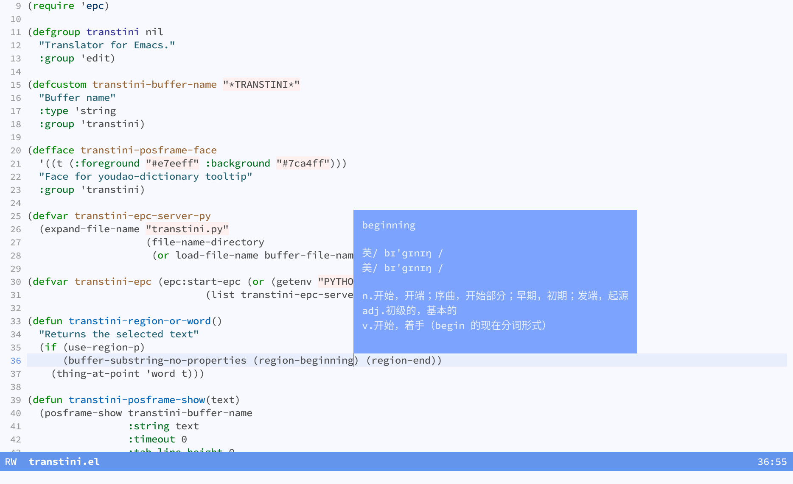

# Transtini

A simple dictionary/translator that uses epc communication.



## Installation

* 1. Python dependencies: `pip3 install epc bs4`

* 2. Elisp dependencies

+ [posframe](https://github.com/tumashu/posframe)
+ [epc](https://github.com/kiwanami/emacs-epc)

```elisp
(require 'transtini)
;; Bind a shortcut key of your choice :)
(global-set-key (kbd "M-y") 'transtini-at-point+)
```
